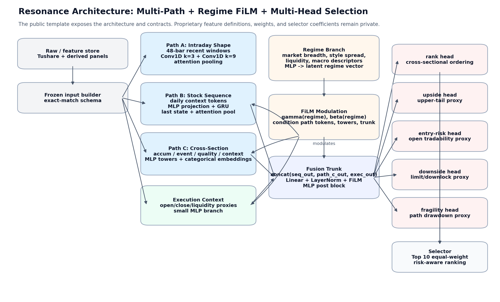
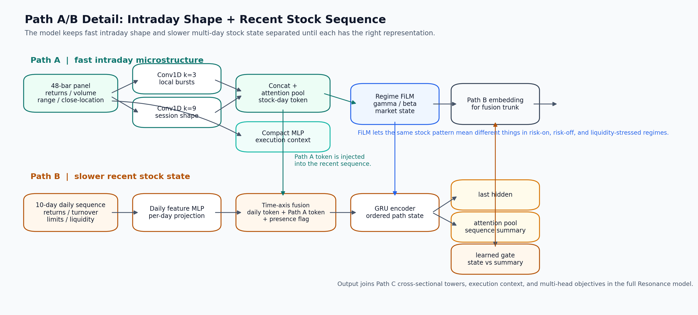
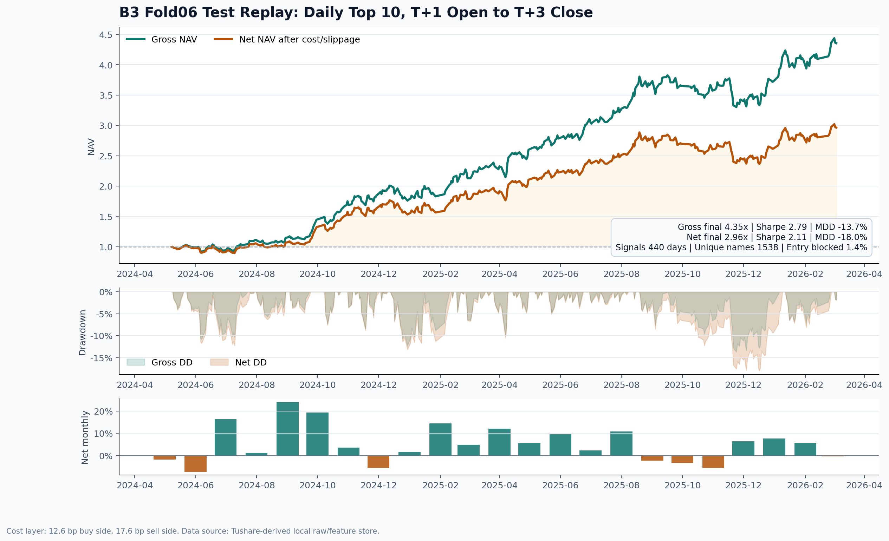
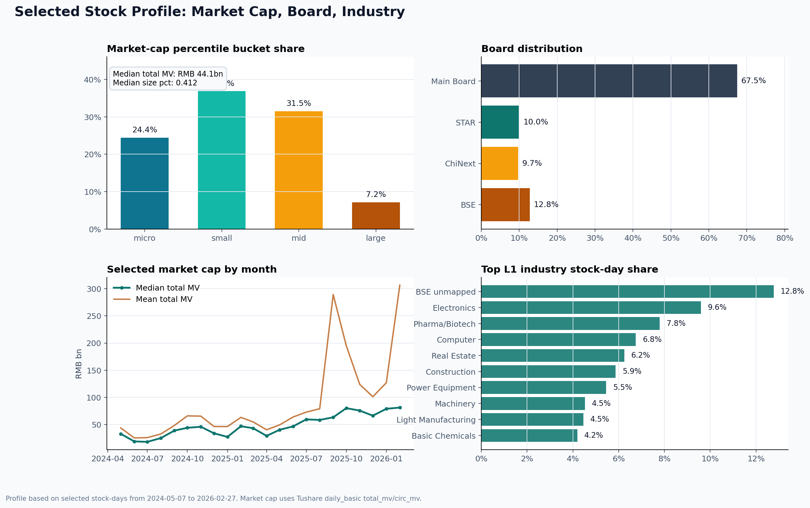

# SignalForge: Multi-Path Deep Learning For A-Share Signal Compression

SignalForge is a short-horizon, medium-frequency cross-sectional stock selection framework for China A-shares. It produces one ranked list per trading day and evaluates the signal under an executable `T+1` adjusted-open entry and `T+3` adjusted-close exit protocol. The public benchmark uses equal-weight daily Top 10 portfolios, while the production alpha layer remains private.

China A-shares are a natural market for this design. The market has broad retail participation, strong sentiment cycles, daily price limits, board-specific liquidity segmentation, ST and suspension edge cases, and frequent shifts between risk appetite and liquidity stress. These features create room for short-horizon cross-sectional signals, while also making leakage control, tradability modeling, and execution-aware evaluation essential.

The core philosophy is signal-to-noise engineering. Classical factor research improves signal-to-noise by designing transformations such as momentum, reversal, quality, liquidity, valuation, and event factors. In deep learning, architecture plays the same role as a learnable compression mechanism: CNNs, GRUs, attention, MLP towers, and FiLM are useful when they are matched to the right data frequency, clean as-of-date samples, and a tradable task definition. The goal is to discard unstable noise while preserving information that survives execution.

This public version focuses on architecture, research-engineering discipline, data hygiene, and evaluation protocol. Production feature definitions, trained weights, API credentials, live selections, exact selector logic, and private training recipes remain private.

## Takeaways

- Multi-rate information works better when it is encoded at the right speed: intraday microstructure, recent daily paths, same-day cross-sectional context, and market regime are separated before fusion.
- Regime conditioning matters in A-shares. The same stock pattern can mean different things in risk-on, risk-off, liquidity-expansion, and liquidity-stressed environments.
- Execution risk deserves explicit modeling. Entry blockage, downside lock risk, and path fragility are predicted as separate heads rather than hidden inside a single alpha score.
- Tushare research needs strict as-of-date hygiene. ST status, BSE old/new code mapping, pre-listing BSE/NEEQ rows, and tradability states can all create subtle leakage.
- Daily inference must be held to an offline-online exact-match contract. A deploy builder should reproduce training-fold tensors on historical dates before it is trusted live.

## Public Code Included

The repository can safely expose engineering components that demonstrate the system design without releasing the alpha layer:

- `signalforge/data_hygiene.py`: as-of-date ST filters from `stock_st` / `namechange`, BSE old/new code mapping from `bse_mapping`, and pre-listing BSE exclusion.
- `signalforge/regime_film.py`: standalone bounded FiLM module for regime-conditioned feature modulation.
- `signalforge/training.py`: sanitized multi-head training loop with batch contracts, loss composition, validation, and epoch-selection hooks.
- `signalforge/backtest.py`: compact Top 10 T+1 open / T+3 close sleeve simulator with blocked entry, delayed exit, gross/net cost layers, and summary metrics.

Private components stay out of scope: production feature builders, checkpoint weights, calibrators, exact selector internals, API keys, cached vendor data, live outputs, and private training recipes.

## Install

```bash
pip install -e .
```

Minimal import check:

```python
from signalforge import RegimeFiLM, TrainingBatch, train_one_epoch
from signalforge.backtest import BacktestConfig, simulate_topk_sleeves
from signalforge.data_hygiene import BseMapping, filter_st_asof
```

## Training Task

Each row is a `(signal_date T, stock)` observation. The model is trained for a short executable holding window:

```text
signal date: T
entry:       T+1 adjusted open
exit target: T+3 adjusted close
```

The main objective learns executable short-horizon return and cross-sectional rank. Auxiliary heads learn favorable upper-tail return, entry blockage, downside/limit-lock risk, path fragility, and intraday ranking. These targets decompose alpha and execution risk into auditable pieces.

Data source: local raw data is built from Tushare tables, including daily prices, adjustment factors, daily basic fields, limit prices, stock lists, ST/name history, BSE mappings, and industry classifications.

## Architecture



The deploy-near model has four representation blocks:

- `Path A`: fast intraday shape encoder for 48-bar within-day panels.
- `Path B`: recent daily sequence encoder for rolling stock state.
- `Path C`: same-day cross-sectional towers for context and metadata.
- `Regime FiLM`: market-state conditioning applied to selected intermediate representations.

The fused representation feeds MLP heads for alpha and execution-risk decomposition.

### Path A And Path B



Path A encodes recent intraday panels shaped as:

```text
[stock, recent_days, 48 intraday bars, intraday_channels]
```

It uses parallel Conv1D branches with short and long kernels, then attention pooling to produce one intraday token per stock-day. Public example feature groups include intraday returns, bar-level volume/amount share, high-low range, close-location, realized volatility, first-session pressure, and late-session reversal.

Path B encodes slower recent stock state. Daily features are projected by an MLP, fused with Path A tokens along the time axis, and passed through a GRU plus attention pooling. This lets the model represent continuation, exhaustion, rebound, liquidity expansion, and limit-price crowding as path-dependent states.

### Path C

Path C handles same-day cross-sectional context through semantic MLP towers:

- accumulation tower: flow and accumulation-style numeric inputs
- event tower: categorical/event context
- quality tower: data quality and liquidity-quality proxies
- context tower: board, industry, size, listing age, and market context
- post tower: fusion of all Path C tower outputs

Public example feature groups include market-cap percentile, board type, industry group, liquidity bucket, listing-age flags, market breadth, style spread, turnover, and risk-appetite descriptors.

### Regime FiLM

The regime branch maps market-state descriptors into bounded FiLM parameters:

```text
conditioned_x = gamma(regime) * x + beta(regime)
```

FiLM is applied to selected Path A tokens, Path B sequence outputs, Path C tower outputs, execution context, and trunk hidden states. This allows the model to reinterpret stock-level signals under changing market regimes while keeping one shared model.

### Fusion And Heads

The final trunk receives:

```text
Path B sequence embedding
+ Path C cross-sectional embedding
+ execution-context embedding
-> LayerNorm
-> Regime FiLM
-> MLP trunk
```

Heads:

- `rank_head`: cross-sectional ranking signal
- `q_head`: favorable-return / upper-tail proxy
- `buy_block_head`: entry-risk proxy
- `downlock_head`: downside / lock-limit risk proxy
- `fragility_head`: adverse path / drawdown proxy
- `intraday_aux_head`: auxiliary intraday rank supervision

The final deploy artifact used for daily inference includes `fragility_head` weights and emits `fragility_pred`.

## Tushare Data Hygiene

The benchmark universe is defined strictly as of signal date `T`.

```text
ST handling: excluded before scoring using historical/as-of status
BSE handling: eligible only after valid BSE listing or old/new code mapping
new listing seasoning: configurable
selection size: daily Top 10
position sizing: equal weight
```

Practical pitfalls:

- ST status must be historical. Current stock names leak future information. Tushare `stock_st` is preferred for daily ST status; `namechange` is useful for auditing intervals with `start_date`, `end_date`, `ann_date`, and `change_reason`.
- BSE requires date-aware code handling. Tushare `bse_mapping` exposes `o_code`, `n_code`, and `list_date`; use it to avoid mixing old NEEQ-style codes with post-mapping BSE symbols.
- Historical BSE data can overlap with NEEQ, selected-layer, and older board records. Pre-listing rows are excluded from the A-share/BSE benchmark unless the strategy explicitly supports that venue and date.
- Board and industry tags should remain auditable. Unmapped BSE industry rows are kept as an explicit `BSE unmapped` bucket.
- Tradability is evaluated from daily raw data: suspensions, invalid quotes, zero traded amount, and open/close limit locks are handled in the execution simulator.

## Backtest Protocol

The public benchmark uses daily Top 10 selection and a three-day overlapping sleeve simulation.

```text
signal date: T
entry:       T+1 adjusted open
exit target: T+3 adjusted close
price basis: raw price * adjustment factor
portfolio:   equal-weight Top 10, three rotating sleeves
```

Rules:

- Entry is blocked if the stock is suspended, has invalid quotes, has non-positive traded amount, or opens at a daily limit.
- Target exit is blocked if the stock is suspended, has invalid quotes, has non-positive traded amount, or closes at a daily limit.
- Blocked entry cash stays idle for that name.
- Blocked target exit is carried until the first later tradable close.
- Labels use forward `T+1` to `T+3` data; fold splits use purge windows to avoid forward-label overlap. The shown fold uses `purge_days = 3` and `embargo_days = 0`.
- Gross curve applies tradability without fees. Net curve applies a display cost layer of 12.6 bp buy side and 17.6 bp sell side, covering a simple slippage/fee/stamp-duty assumption.

## Historical Result

The public result uses `b3 fold06`, epoch 75. `b3 fold06` is one fold from the broader internal backtest set; it is shown here because it is close to the current deployment period and has a comparatively complete test window.

Epoch selection was done on the validation set using the same Top 10 execution-aware backtest and objective:

```text
objective = 0.5 * annualized_return + 0.5 * Sharpe
```

The result is shown as one continuous test replay from `2024-05-07` to `2026-02-27` signal dates.



| Metric | Gross | Net Cost/Slippage |
| --- | ---: | ---: |
| Signal dates | 440 | 440 |
| Curve window | 2024-05-08 to 2026-03-04 |
| Final NAV | 4.3536 | 2.9628 |
| Annualized return | 131.8% | 86.0% |
| Sharpe | 2.79 | 2.11 |
| Max drawdown | -13.7% | -18.0% |
| Positive-day ratio | 58.1% | 56.6% |
| Entry block rate | 1.41% | 1.41% |
| Target exit block rate | 7.05% | 7.05% |
| Average delayed-exit days | 2.45 | 2.45 |
| Unique selected codes | 1,538 | 1,538 |

## Selected Stock Profile



Profile over selected stock-days from `2024-05-07` to `2026-02-27`:

- Median total market cap: RMB `44.1bn`; mean total market cap: RMB `86.3bn`.
- Market-cap percentile buckets: micro `24.4%`, small `36.9%`, mid `31.5%`, large `7.2%`.
- Board mix: Main Board `67.5%`, STAR `10.0%`, ChiNext `9.7%`, BSE `12.8%`.
- Top L1 industry buckets: BSE unmapped `12.8%`, Electronics `9.6%`, Pharma/Biotech `7.8%`, Computer `6.8%`, Real Estate `6.2%`.

The profile shows a broad small/mid-cap tilt with visible BSE exposure. The `BSE unmapped` bucket remains explicit because historical SW industry mapping is incomplete for part of the BSE universe.

## Offline-Online Exact Match

Daily inference is deploy-ready only if the daily builder can reproduce training-fold inputs on historical dates.

Required controls:

- frozen feature schema in the deploy artifact
- frozen categorical vocabularies and normalizers
- shared input-builder logic between backtest and daily inference
- exact-match validation on known historical dates
- append-only daily selection records
- stable machine-readable output columns

For any historical fold date, rebuild tensors from raw Tushare data and compare them with the training tensors. This catches silent feature drift before live inference.

## Daily Inference Contract

The daily pipeline assumes Tushare raw data has already been appended locally:

```text
raw Tushare tables
-> Path A/B/C feature partitions
-> deploy artifact input builder
-> model scoring
-> Top 10 selector
-> daily records and append-only all_selections table
```

Expected output files:

```text
daily_top10_records/top10_latest.csv
daily_top10_records/top10_history.csv
daily_top10_records/trade_date=YYYYMMDD/top10_record.csv
daily_top10_records/selections/all_selections.csv
daily_top10_records/selections/latest_selection_row.csv
```

The one-row daily selection table contains `trade_date`, copy-ready Top 10 code strings, rank-level codes, weights, scores, board tags, and industry tags.

## Repo Layout

```text
signalforge/
  __init__.py
  data_hygiene.py
  regime_film.py
  training.py
  backtest.py
open_source_assets/
  signalforge_detailed_architecture.png
  signalforge_path_ab_detail.png
  b3_fold06_extended_equity_curve.png
  b3_fold06_selected_stock_profile.png
docs/
  architecture.md
  data_hygiene_tushare.md
  backtest_protocol.md
  daily_inference_contract.md
examples/
  synthetic_raw/
  sample_all_selections.csv
tests/
  test_data_hygiene.py
  test_backtest.py
```

## References

- Tushare stock list and API index: https://tushare.pro/document/2?doc_id=25
- Tushare historical name changes: https://tushare.pro/document/2?doc_id=100
- Tushare BSE old/new code mapping: https://tushare.pro/document/2?doc_id=375
- Tushare historical ST list: https://tushare.pro/document/2?doc_id=397
- CSRC discussion of BSE/NEEQ layered market: https://www.csrc.gov.cn/csrc/c101800/c7162173/content.shtml
- Stamp-duty halving notice: https://shanghai.chinatax.gov.cn/zcfw/zcfgk/yhs/202308/t468451.html
- SZSE fee schedule: https://www.szse.cn/marketServices/deal/payFees/

## Disclosure

This repository is an architecture and engineering template. The historical result is included to make the evaluation protocol concrete. It provides no investment advice or performance guarantee, and it intentionally omits private production alpha assets.

## License And Contact

SignalForge is licensed under the `PolyForm Noncommercial License 1.0.0`. Noncommercial research, study, and evaluation are allowed under that license. Commercial use, production use, redistribution outside the license terms, or use in a trading system requires prior written permission.

For permission, collaboration, recruiting discussion, or commercial use:

```text
Patrick Peiyu He
patrick.peiyu.he@gmail.com
https://github.com/PatrickPeiyuHe
```
